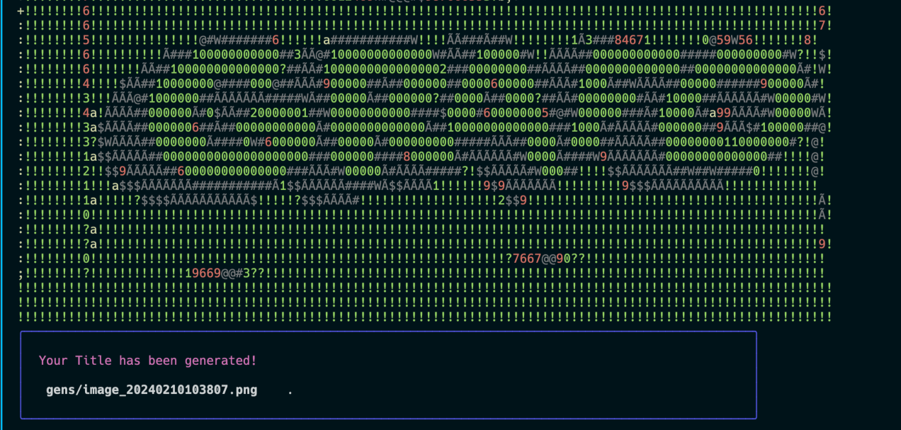

# Grafo: CLI Title Generator

Grafo is a command-line interface (CLI) title generator developed in Go. It utilizes the Huh package for user input and the Dall-e image generator to create unique title images. This tool provides a fun and innovative way to generate stylish, personalized titles for your projects or presentations.

## Usage

Follow these steps to use Grafo:

1. Execute the program: `go run main.go`
2. Input your desired title when asked.
3. Select a background color for your title.
4. Verify that your OpenAI API key is configured in your environment.
5. Wait for the title generation process to complete.

The generated title will be shown in the terminal and also saved as an image.

## Contributing

We welcome your contributions! If you have a feature suggestion or bug report, feel free to open a PR or an issue.

## Future Enhancements

We're planning to add more features, including:
- More customization options for the title, such as font, size, effects, etc.
- Integration with other image generation APIs
- Improved error handling and user input validation
- Option to save the title in different image formats

## Dependencies

This project relies on the following packages:
- Huh for user input
- Dall-e image generator for generating images
- Lipgloss for styling terminal output

## Notes 

Before running the program, please ensure to set your OpenAI API key in your environment.
